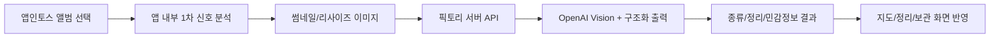

# 픽토리 운영 실행 메모

## 결론

픽토리는 로컬 브라우저에서 UI와 파일 선택은 검증할 수 있지만, 앱인토스 광고와 일부 네이티브 동작은 `.ait` 업로드 후 토스 앱 QR에서 확인해야 한다.

## 로컬 실행

```bash
npm install
npm run web:dev -- --host 127.0.0.1 --port 5173
```

로컬 브라우저에서는 실제 파일 선택 fallback으로 사진 분류 UI를 확인한다.

## 앱인토스 빌드와 QR 테스트

```bash
npm run test
npm run typecheck
npm run lint
npm run build
```

`npm run build`가 만든 `pictory.ait`를 앱인토스 콘솔에 업로드한다.

콘솔 경로:

1. 워크스페이스 선택
2. 앱 선택
3. 앱 릴리즈
4. `.ait` 업로드
5. 테스트하기 QR 스캔

QR 테스트 조건:

- 토스 앱 로그인
- 워크스페이스 멤버 계정
- 만 19세 이상 계정
- 출시 심사 전 최소 1회 이상 실제 테스트

## 광고 운영

현재 앱은 `loadFullScreenAd`와 `showFullScreenAd`를 사용한다.

운영 흐름:

1. 앱 진입 시 보상형 광고를 미리 로드한다.
2. 사용자가 `광고 +100`을 누르면 로드된 광고를 표시한다.
3. `userEarnedReward` 이벤트가 온 경우에만 스캔권을 지급한다.
4. 광고가 닫히면 다음 광고를 다시 미리 로드한다.

개발 중에는 반드시 테스트 광고 ID를 사용한다.

```env
VITE_TOSS_REWARDED_AD_GROUP_ID=ait-ad-test-rewarded-id
```

운영 빌드에서는 앱인토스 콘솔에서 보상형 광고 그룹을 만들고 발급받은 광고 그룹 ID를 넣는다.

```env
VITE_TOSS_REWARDED_AD_GROUP_ID=콘솔_보상형_광고_그룹_ID
```

주의:

- 샌드박스 앱에서는 인앱 광고를 테스트할 수 없다.
- 실제 광고 ID로 개발 테스트를 반복하면 정책 위반이 될 수 있다.
- 광고는 서비스 진입 직후 강제 노출하지 않는다.
- 보상은 광고 클릭이 아니라 `userEarnedReward` 기준으로만 지급한다.

## 이미지 분류 운영 구조

돈을 받을 수 있는 수준의 분류는 서버 AI가 필요하다. 앱 안에 OpenAI 키를 넣으면 키가 노출되므로 금지한다.

단, 서버 AI를 모든 사진에 무조건 호출하면 수익성이 무너진다. 픽토리는 앱 내부에서 1차 분류한 뒤 아래 후보만 서버로 보낸다.

- confidence가 낮은 사진
- 민감정보 후보
- 영수증, 문서, 쿠폰, 인물처럼 오분류 비용이 큰 사진
- 사용자가 실제 정리/보관 행동을 할 가능성이 높은 사진

현재 앱은 서버 AI 요청을 한 번에 최대 40장으로 제한하고, 전송 전 이미지를 512px JPEG로 줄인다.

권장 구조:



앱의 역할:

- 앨범 권한 요청
- 이미지 리사이즈와 1차 분류
- 사용자 크레딧/플랜 상태 표시
- 서버가 준 분류 결과 표시
- 원본 사진 저장 금지

서버의 역할:

- OpenAI API 키 보관
- 월간 크레딧/광고 크레딧/유료 플랜 검증
- 이미지 정밀 분류
- 비용 제한과 rate limit
- 결제 검증
- 민감정보 로그 저장 금지

## 수익성 방어 원칙

서버 AI 비용은 무료 사용자가 광고를 보거나 유료 플랜으로 전환할 가능성이 있을 때만 써야 한다.

권장 정책:

- 무료 사용자는 앱 내부 1차 분류를 먼저 보여준다.
- 광고를 본 뒤 받은 크레딧으로 서버 AI 정밀 분류를 열어준다.
- 유료 사용자는 월 제공량 안에서 서버 AI 정밀 분류를 제공한다.
- 같은 사진은 perceptual hash 기준으로 중복 과금하지 않는다.
- 서버는 사용자별 월 한도와 분당 요청 한도를 강제한다.
- 서버 로그에는 base64 원본, 신분증, 카드번호, 계좌번호를 남기지 않는다.

수익 구조상 피해야 할 것:

- 앱 진입만 해도 전체 앨범을 서버 AI로 보내기
- 무료 사용자에게 수천 장 정밀 분류를 무제한 제공하기
- 광고 보상보다 큰 AI 비용을 즉시 발생시키기
- 원본 이미지를 장기 저장해서 스토리지 비용과 개인정보 리스크를 키우기

## AI 분류 API 계약

앱은 `VITE_PICTORY_CLASSIFY_ENDPOINT`가 있을 때만 서버 AI 분류를 호출한다.

요청:

```json
{
  "schemaVersion": 1,
  "items": [
    {
      "id": "photo-id",
      "fileName": "receipt.jpg",
      "createdAt": "2026-06-15T09:00:00.000Z",
      "hints": ["receipt"],
      "signals": {
        "width": 720,
        "height": 960,
        "aspectRatio": 0.75,
        "brightness": 0.8,
        "saturation": 0.2,
        "edgeDensity": 0.3,
        "textLineScore": 0.5,
        "colorVariance": 0.1,
        "perceptualHash": "..."
      },
      "imageDataUri": "data:image/jpeg;base64,..."
    }
  ]
}
```

응답:

```json
{
  "items": [
    {
      "id": "photo-id",
      "categoryId": "receipt",
      "cleanBucketId": "sensitive",
      "confidence": 0.93,
      "privacy": "sensitive",
      "reasons": ["영수증", "카드 결제", "개인정보 가능"],
      "hints": ["receipt", "영수증"]
    }
  ]
}
```

허용 값:

- `categoryId`: `capture`, `document`, `receipt`, `food`, `place`, `people`, `coupon`, `memory`
- `cleanBucketId`: `sensitive`, `needsReview`, `similar`, `dark`, `capturePile`, `keep`
- `privacy`: `normal`, `review`, `sensitive`

## OpenAI 분류 프롬프트 방향

서버에서는 Vision 모델에 이미지를 넣고 JSON Schema로 결과를 강제한다.

권장 라벨:

- 종류: 캡처, 문서, 영수증, 음식, 장소, 사람, 쿠폰, 기록
- 정리 후보: 민감정보 후보, 확인 필요, 비슷한 사진, 어두운 사진, 캡처 더미, 보관 후보
- 민감정보: 주민등록증, 여권, 운전면허증, 카드번호, 계좌번호, 인증번호, 계약서, 병원/금융 문서

이미지 원본은 저장하지 않고, 서버 로그에도 base64 본문을 남기지 않는다.

## 수익 구조

무료:

- 월 기본 정리 40장
- 보관 10장
- 광고 시청 시 스캔권 +100장

Plus:

- 월 정리 500장
- 보관 200장
- 월 구독 결제

Pro:

- 월 정리 2,000장
- 보관 1,000장
- 대량 정리와 우선 처리

대량 정리는 한 번에 전부 처리하지 말고 100~300장 단위 배치로 나눠야 한다. 앱 메모리, 네트워크 비용, AI 비용, 실패 재시도 때문에 배치 처리가 안전하다.
