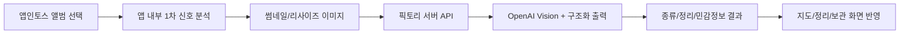

# 픽토리 운영 실행 메모

## 결론

픽토리는 로컬 브라우저에서 UI와 파일 선택은 검증할 수 있지만, 앱인토스 광고와 일부 네이티브 동작은 `.ait` 업로드 후 토스 앱 QR에서 확인해야 한다.

## 로컬 실행

```bash
npm install
npm run web:dev -- --host 127.0.0.1 --port 5173
```

로컬 브라우저에서는 실제 파일 선택 fallback으로 사진 분류 UI를 확인한다.

## 운영 환경 변수 분리

클라이언트 공개 환경 변수는 `VITE_` 접두사를 사용한다. 이 값은 앱 번들에 포함될 수 있으므로 endpoint, 광고 ID, 구독 SKU처럼 공개되어도 되는 값만 둔다.

```env
VITE_TOSS_REWARDED_AD_GROUP_ID=ait-ad-test-rewarded-id
VITE_PICTORY_PLUS_SUBSCRIPTION_SKU=replace_with_toss_plus_subscription_sku
VITE_PICTORY_PRO_SUBSCRIPTION_SKU=replace_with_toss_pro_subscription_sku
VITE_PICTORY_CLASSIFY_ENDPOINT=https://your-api.example.com/pictory/classify
```

서버 AI 런타임 환경 변수는 서버 배포 환경에만 설정한다. OpenAI 키, 서버 secret, 사용자별 quota 값에는 `VITE_` 접두사를 붙이지 않는다.

```env
PICTORY_SERVER_SECRET=replace_with_long_random_server_secret
OPENAI_API_KEY=replace_with_openai_api_key_server_only
OPENAI_MODEL=gpt-4.1-mini
PICTORY_AI_FREE_MONTHLY_QUOTA=0
PICTORY_AI_AD_CREDIT_QUOTA=100
PICTORY_AI_PLUS_MONTHLY_QUOTA=500
PICTORY_AI_PRO_MONTHLY_QUOTA=2000
PICTORY_AI_RATE_LIMIT_PER_MINUTE=30
PICTORY_AI_LOG_RAW_IMAGES=false
```

서버 로그에는 원본 이미지, base64 본문, 신분증/카드/계좌번호 같은 민감정보를 남기지 않는다.

## 앱인토스 빌드와 QR 테스트

```bash
npm run test
npm run typecheck
npm run lint
npm run build
npm run check:release
```

`npm run build`가 만든 `pictory.ait`를 앱인토스 콘솔에 업로드한다. `npm run check:release`는 업로드 전 `.env.example`, `pictory.ait`, Granite 필수 설정, 테스트 스크립트 존재 여부를 읽기 전용으로 확인한다.

콘솔 경로:

1. 워크스페이스 선택
2. 앱 선택
3. 앱 릴리즈
4. `.ait` 업로드
5. 테스트하기 QR 스캔

실행자 체크리스트:

- [ ] `.env`에 실제 비밀값이 없고, 클라이언트 값은 `VITE_` 공개 값만 들어 있다.
- [ ] 서버 OpenAI 키와 `PICTORY_SERVER_SECRET`은 서버 배포 환경에만 설정했다.
- [ ] `npm run test`, `npm run typecheck`, `npm run lint`, `npm run build`, `npm run check:release`가 통과했다.
- [ ] 업로드한 파일명이 최신 `pictory.ait`인지 확인했다.
- [ ] 테스트 단말에서 토스 앱에 로그인했다.
- [ ] 테스트 계정이 앱인토스 워크스페이스 멤버이고 만 19세 이상이다.
- [ ] 콘솔의 `테스트하기` QR을 실제 단말 토스 앱으로 스캔했다.
- [ ] 사진 권한 요청이 뜨고, 허용 후 앨범 선택 화면이 열린다.
- [ ] 선택 취소 시 실패가 아니라 빈 결과/대기 상태로 돌아온다.
- [ ] 실제 사진 선택 후 지도, 정리, 보관 화면의 분류 결과와 민감정보 흐림 처리를 확인했다.
- [ ] 앱 재실행 후 최근 분류 지도, 보관 항목, 스캔 기록이 복원된다.
- [ ] 실패가 있으면 단말 OS, 토스 앱 버전, 콘솔 앱 버전, QR 생성 시각, 재현 화면을 기록했다.

## 광고 운영

현재 앱은 `loadFullScreenAd`와 `showFullScreenAd`를 사용한다.

운영 흐름:

1. 앱 진입 시 보상형 광고를 미리 로드한다.
2. 사용자가 `광고 +100`을 누르면 로드된 광고를 표시한다.
3. `userEarnedReward` 이벤트가 온 경우에만 스캔권을 지급한다.
4. 광고가 닫히면 다음 광고를 다시 미리 로드한다.

개발 중에는 반드시 테스트 광고 ID를 사용한다.

```env
VITE_TOSS_REWARDED_AD_GROUP_ID=ait-ad-test-rewarded-id
```

운영 빌드에서는 앱인토스 콘솔에서 보상형 광고 그룹을 만들고 발급받은 광고 그룹 ID를 넣는다.

```env
VITE_TOSS_REWARDED_AD_GROUP_ID=콘솔_보상형_광고_그룹_ID
```

실기기 광고 체크리스트:

- [ ] 개발/반복 테스트 빌드는 `ait-ad-test-rewarded-id`를 사용한다.
- [ ] 운영 후보 빌드는 콘솔에서 발급한 보상형 광고 그룹 ID를 사용한다.
- [ ] QR 진입 직후 광고가 강제 노출되지 않는다.
- [ ] `광고 +100`을 누르면 광고가 열리고, 닫기만 하면 스캔권이 지급되지 않는다.
- [ ] 광고를 끝까지 보고 `userEarnedReward` 이벤트가 발생한 경우에만 스캔권 +100장이 지급된다.
- [ ] `failedToShow`, 미지원, 네트워크 실패에서는 스캔권이 0장으로 유지된다.
- [ ] 광고 종료 후 다음 광고 preload가 다시 시도된다.
- [ ] 검증 증거로 광고 그룹 ID 종류, 단말, 토스 앱 버전, 지급 전/후 스캔권 화면을 남긴다.

주의:

- 샌드박스 앱에서는 인앱 광고를 테스트할 수 없다.
- 실제 광고 ID로 개발 테스트를 반복하면 정책 위반이 될 수 있다.
- 광고는 서비스 진입 직후 강제 노출하지 않는다.
- 보상은 광고 클릭이 아니라 `userEarnedReward` 기준으로만 지급한다.

## 이미지 분류 운영 구조

돈을 받을 수 있는 수준의 분류는 서버 AI가 필요하다. 앱 안에 OpenAI 키를 넣으면 키가 노출되므로 금지한다.

단, 서버 AI를 모든 사진에 무조건 호출하면 수익성이 무너진다. 픽토리는 앱 내부에서 1차 분류한 뒤 아래 후보만 서버로 보낸다.

- confidence가 낮은 사진
- 민감정보 후보
- 영수증, 문서, 쿠폰, 인물처럼 오분류 비용이 큰 사진
- 사용자가 실제 정리/보관 행동을 할 가능성이 높은 사진

현재 앱은 무료 기본 사용량에서는 서버 AI를 호출하지 않는다. 유료 플랜이거나 광고 시청으로 받은 크레딧이 있을 때만 서버 AI 정밀 분류를 켠다.

서버 AI 요청은 한 번에 최대 40장으로 제한하고, 전송 전 이미지를 512px JPEG로 줄인다.

권장 구조:



앱의 역할:

- 앨범 권한 요청
- 이미지 리사이즈와 1차 분류
- 브라우저 네이티브 감지기로 QR/바코드, 얼굴, 텍스트 영역 힌트 추출
- 사용자 크레딧/플랜 상태 표시
- 서버가 준 분류 결과 표시
- 원본 사진 저장 금지

서버의 역할:

- OpenAI API 키 보관
- 월간 크레딧/광고 크레딧/유료 플랜 검증
- 이미지 정밀 분류
- 비용 제한과 rate limit
- 결제 검증
- 민감정보 로그 저장 금지

## 수익성 방어 원칙

서버 AI 비용은 무료 사용자가 광고를 보거나 유료 플랜으로 전환할 가능성이 있을 때만 써야 한다.

권장 정책:

- 무료 사용자는 앱 내부 1차 분류를 먼저 보여준다.
- QR/바코드, 얼굴, 텍스트 영역은 지원되는 환경에서 앱 자체 감지기를 우선 사용한다.
- 광고를 본 뒤 받은 크레딧이 있을 때 서버 AI 정밀 분류를 열어준다.
- 유료 사용자는 월 제공량 안에서 서버 AI 정밀 분류를 제공한다.
- 같은 사진은 perceptual hash 기준으로 중복 과금하지 않는다.
- 서버는 사용자별 월 한도와 분당 요청 한도를 강제한다.
- 서버 로그에는 base64 원본, 신분증, 카드번호, 계좌번호를 남기지 않는다.

수익 구조상 피해야 할 것:

- 앱 진입만 해도 전체 앨범을 서버 AI로 보내기
- 무료 사용자에게 수천 장 정밀 분류를 무제한 제공하기
- 광고 보상보다 큰 AI 비용을 즉시 발생시키기
- 원본 이미지를 장기 저장해서 스토리지 비용과 개인정보 리스크를 키우기

## AI 분류 API 계약

앱은 공개 클라이언트 값인 `VITE_PICTORY_CLASSIFY_ENDPOINT`가 있을 때만 서버 AI 분류를 호출한다. OpenAI 키, 서버 secret, quota 검증은 이 endpoint 뒤의 서버에서만 처리한다.

운영 요청 헤더 예시:

```http
POST /pictory/classify HTTP/1.1
Content-Type: application/json
Authorization: Bearer <user_or_session_token>
x-pictory-server-secret: <server_to_server_secret>
x-request-id: req_20260615_001
```

`Authorization`과 `x-pictory-server-secret`은 운영 서버의
`verifyEntitlement`가 검증할 수 있도록 요청 컨텍스트에 전달한다. 핸들러
자체는 secret 값을 하드코딩해서 비교하지 않는다. 서버는 이 헤더/토큰으로
사용자 식별, 유료 권한, 광고 크레딧, 월간 quota를 검증해야 하며, 클라이언트
`planId`나 로컬 상태만으로 entitlement/quota를 승인하지 않는다.

요청:

```json
{
  "schemaVersion": 1,
  "items": [
    {
      "id": "photo-id",
      "fileName": "receipt.jpg",
      "createdAt": "2026-06-15T09:00:00.000Z",
      "hints": ["receipt"],
      "signals": {
        "width": 720,
        "height": 960,
        "aspectRatio": 0.75,
        "brightness": 0.8,
        "saturation": 0.2,
        "edgeDensity": 0.3,
        "textLineScore": 0.5,
        "colorVariance": 0.1,
        "perceptualHash": "..."
      },
      "imageDataUri": "data:image/jpeg;base64,..."
    },
    {
      "id": "sensitive-photo-id",
      "hints": ["id", "sensitive"],
      "signals": {
        "width": 720,
        "height": 960,
        "aspectRatio": 0.75,
        "brightness": 0.7,
        "saturation": 0.15,
        "edgeDensity": 0.4,
        "textLineScore": 0.6,
        "colorVariance": 0.2
      },
      "redacted": true
    }
  ]
}
```

`privacy !== "normal"` 이거나 `cleanBucketId === "sensitive"` 인 항목은
`imageDataUri`를 보내지 않고 `redacted: true`로 보낸다. 이미지 리사이즈나
인코딩을 할 수 없는 환경에서도 원본 `dataUri`로 대체하지 않고 같은 방식으로
redacted 처리한다. redacted 항목은 원본 `fileName`, 정확한 `createdAt`,
`perceptualHash`를 보내지 않고 힌트와 비식별 신호만 보낸다. 서버 응답이 로컬
`privacy`의 `review`/`sensitive` 또는 `cleanBucketId`의
`needsReview`/`sensitive` 판정을 더 약하게 바꾸려 하면 클라이언트는 기존
판정을 유지하고, 더 강한 판정으로 올리는 응답만 반영한다.

응답:

```json
{
  "items": [
    {
      "id": "photo-id",
      "categoryId": "receipt",
      "cleanBucketId": "sensitive",
      "confidence": 0.93,
      "privacy": "sensitive",
      "reasons": ["영수증", "카드 결제", "개인정보 가능"],
      "hints": ["receipt", "영수증"]
    }
  ]
}
```

허용 값:

- `categoryId`: `capture`, `document`, `receipt`, `food`, `place`, `people`, `coupon`, `memory`
- `cleanBucketId`: `sensitive`, `needsReview`, `similar`, `dark`, `capturePile`, `keep`
- `privacy`: `normal`, `review`, `sensitive`

## OpenAI 분류 프롬프트 방향

서버에서는 Vision 모델에 이미지를 넣고 JSON Schema로 결과를 강제한다.

권장 라벨:

- 종류: 캡처, 문서, 영수증, 음식, 장소, 사람, 쿠폰, 기록
- 정리 후보: 민감정보 후보, 확인 필요, 비슷한 사진, 어두운 사진, 캡처 더미, 보관 후보
- 민감정보: 주민등록증, 여권, 운전면허증, 카드번호, 계좌번호, 인증번호, 계약서, 병원/금융 문서

이미지 원본은 저장하지 않고, 서버 로그에도 base64 본문을 남기지 않는다.
민감/검토 항목은 클라이언트에서 이미지 본문을 아예 제외하므로 서버가 원본을
받는 경로도 만들지 않는다.

## 수익 구조

무료:

- 월 기본 정리 40장
- 보관 10장
- 광고 시청 시 스캔권 +100장

Plus:

- 월 정리 500장
- 보관 200장
- 월 구독 결제

Pro:

- 월 정리 2,000장
- 보관 1,000장
- 대량 정리와 우선 처리

대량 정리는 한 번에 전부 처리하지 말고 100~300장 단위 배치로 나눠야 한다. 앱 메모리, 네트워크 비용, AI 비용, 실패 재시도 때문에 배치 처리가 안전하다.

## 결제 권한 방어

클라이언트에 저장된 `planId`는 실제 결제 권한으로 보지 않는다.

- 운영 환경에서는 인앱결제 상품 지급, 미결 주문 복원, 주문 상태 조회 API 중 하나로 검증된 권한만 유료 플랜으로 인정한다.
- 서버 결제 검증이 붙기 전까지 운영 빌드는 무료 플랜과 광고 보상 크레딧만 실제 한도로 사용한다.
- Plus/Pro 한도 미리보기는 `localhost`, `127.0.0.1`, `::1` 개발 환경에서만 허용한다.
- 서버 AI 정밀 분류는 광고 크레딧이 있거나 검증된 유료 권한이 있을 때만 사용한다.
- 결제 성공 후 상품 지급에 실패하면 사용자에게 실패를 알리고, 앱 재실행 시 미결 주문 복원을 먼저 처리해야 한다.

현재 앱 코드는 앱인토스 구독 결제 SDK를 호출한다.

```env
VITE_PICTORY_PLUS_SUBSCRIPTION_SKU=콘솔_PLUS_구독_SKU
VITE_PICTORY_PRO_SUBSCRIPTION_SKU=콘솔_PRO_구독_SKU
```

실기기 IAP 체크리스트:

- [ ] 앱인토스 콘솔에 Plus/Pro 구독 상품과 SKU가 등록되어 있다.
- [ ] `.env`의 `VITE_PICTORY_PLUS_SUBSCRIPTION_SKU`, `VITE_PICTORY_PRO_SUBSCRIPTION_SKU`가 콘솔 SKU와 일치한다.
- [ ] SKU가 비어 있거나 틀린 빌드에서는 Plus/Pro 구매 버튼이 결제 성공처럼 보이지 않는다.
- [ ] 실제 단말 QR에서 Plus 결제를 시작하면 구독 주문 화면이 뜬다.
- [ ] 결제 성공 후 상품 지급 콜백이 끝난 뒤에만 Plus 한도가 활성화된다.
- [ ] 결제 중 취소하면 무료 플랜 상태와 기존 크레딧이 유지된다.
- [ ] 상품 지급 실패 또는 앱 종료 후 재실행 시 미결 주문 복원 흐름이 먼저 실행된다.
- [ ] 구독 정보 복원 성공 시 저장된 주문 ID 기준으로 유료 권한이 복원된다.
- [ ] 검증 증거로 SKU, orderId 일부 마스킹 값, 지급 전/후 플랜 화면, 실패/취소 화면을 남긴다.

운영 동작:

1. 앱 시작 시 저장된 `orderId`가 있으면 `getSubscriptionInfo`로 접근 가능 상태를 복원한다.
2. 저장된 주문이 없거나 복원되지 않으면 `getPendingOrders`로 미지급 주문을 확인하고 `completeProductGrant`를 호출한다.
3. Plus/Pro 버튼은 로컬 개발에서는 미리보기로 동작하고, 운영에서는 `createSubscriptionPurchaseOrder`로 구독 결제를 시작한다.
4. `success` 이벤트와 상품 지급 콜백이 완료된 뒤에만 유료 플랜을 활성화한다.
